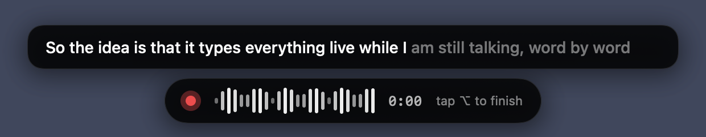
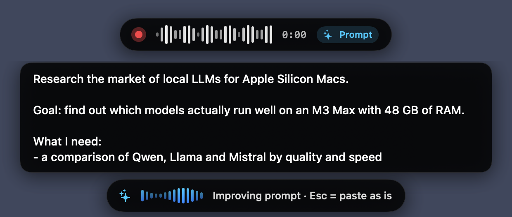
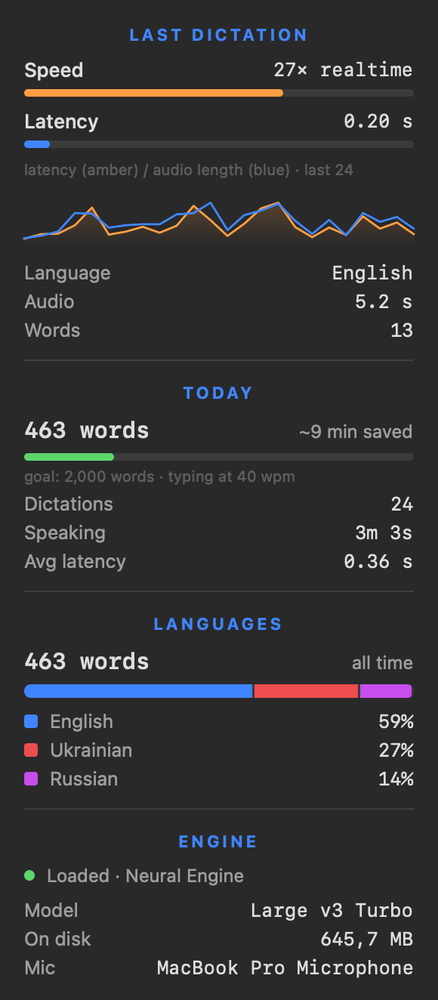
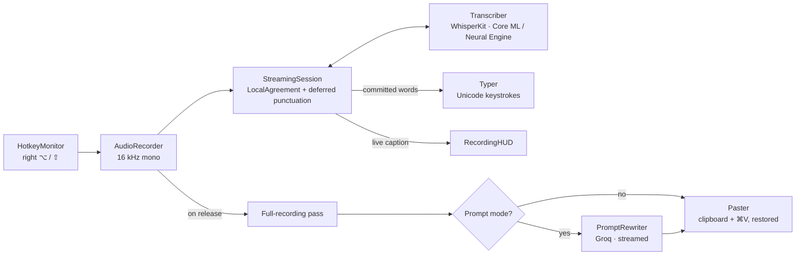

<div align="center">

# Local Whisper

**Hold a key, speak, and watch your words appear in any app — transcribed live, entirely on your Mac.**




</div>

---

## Why this exists

Typing is often the slowest part of working with a computer — especially now that so much work means
*describing* things: messages, tickets, code reviews, and long prompts for AI assistants.

Built-in dictation often stumbles on technical vocabulary and on sentences that mix two languages.
Most cloud dictation tools send every word you say to someone else's server. Open-source Whisper tools are
accurate and private, but they make you wait until you stop talking before showing anything.

**Local Whisper closes that gap**: an OpenAI Whisper model running on the Apple Neural Engine, a
streaming engine that types words *while you are still speaking*, and a menu bar app that works in every
text field on macOS — with no account, no subscription, and no audio ever leaving the machine.

## Who it is for

- **Developers and technical people** who dictate messages, commit descriptions, docs and code-review
  comments full of jargon.
- **Heavy AI-assistant users** who write long prompts to ChatGPT or Claude and want them well structured
  without the effort.
- **Bilingual speakers** who naturally mix languages in one sentence (for example Russian or Ukrainian
  with English technical terms).
- **Privacy-conscious professionals** who cannot send voice recordings to third-party clouds.
- Anyone with RSI, fatigue, or simply *"too lazy to type right now"*.

## Highlights

| | |
|---|---|
| 🎙 **Push-to-talk anywhere** | Hold right ⌥, speak, release. Works in any app that accepts text. |
| ⚡ **Live streaming** | Words are typed as you speak, typically within a second of saying them. |
| 🔒 **Private by design** | Speech recognition runs 100% on-device. No account, no telemetry. |
| 🌍 **Mixed-language mode** | Keeps English phrases intact inside Russian or Ukrainian speech. |
| ✨ **Prompt mode** | ⇧ + right ⌥ turns a rambling spoken request into a structured AI prompt. |
| 📊 **Built-in stats** | Speed, latency, words per day, time saved and language breakdown. |
| 🪶 **Lightweight** | Native Swift menu bar app, about 5 MB plus the model you choose. |

## How it compares

| | Local Whisper | Built-in OS dictation | Cloud dictation apps | Whisper CLI / file transcribers |
|---|:---:|:---:|:---:|:---:|
| Audio stays on the device | ✅ | varies | ❌ | ✅ |
| Text appears while you speak | ✅ | ✅ | ✅ | ❌ |
| Works in any app via a global hotkey | ✅ | ✅ | ✅ | ❌ |
| Dedicated mode for mixing two languages in one sentence | ✅ | limited | varies | ❌ |
| Custom vocabulary for names and jargon | ✅ | limited | varies | manual |
| Turns speech into a structured AI prompt | ✅ | ❌ | varies | ❌ |
| Free and open source | ✅ | ✅ | ❌ | ✅ |

## Features

### Live dictation

- **Hold-to-talk** with right ⌥, or **tap once for hands-free** mode and tap again to finish.
- A floating pill shows a live waveform, a timer, and the transcript: confirmed words in white, the
  tentative tail in grey.
- Text is typed directly with synthetic keystrokes — **your clipboard is never touched** while streaming.
- **Esc** cancels. Pressing any other key while holding ⌥ is treated as a normal ⌥ shortcut, not a dictation.

### Prompt mode



Hold **⇧ + right ⌥** (in either order) and describe a task the way you would say it out loud:

> *"okay so research the local LLM market for MacBooks, like what actually runs on an M3 Max with 48 gigs, compare qwen, llama and stuff"*

When you release, the full recording is transcribed and sent to an LLM (Qwen via the Groq API) with a
carefully designed meta-prompt. It returns a structured prompt — goal, deliverables, scope, output
format, and a request for clarifying questions if key details are missing. The result streams into the
pill and is pasted into ChatGPT, Claude, or any other app. **It never presses Enter**, so you stay in control.

Press **Esc** at any time to paste the plain dictation instead. The same fallback applies when there is
no API key, no network, or a rate limit.

### Menu bar and statistics



The menu bar item is the whole interface:

- **Model** — Large v3 Turbo (best quality), Small, or Base (fastest).
- **Language** — auto-detect, a single language, or a mixed Russian + English / Ukrainian + English mode.
- **Type as You Speak** — stream words into the app, or show them only in the pill and paste the
  highest-quality full-recording transcript when you release.
- **Custom Vocabulary** — names and terms Whisper should always spell your way.
- **Stats** — speed relative to real time, latency history, words today, estimated minutes saved
  against typing, and a per-language breakdown.
- **History** — the last dictations; click one to copy it.
- **Prompt Mode** — Groq API key (kept in the macOS Keychain) and model selection.
- **Launch at Login** and **Play Sounds**.

<br clear="right">

## What is new under the hood

Local Whisper is not a thin wrapper around a model. Getting Whisper to feel instant and reliable inside
other apps required several pieces of original engineering.

### 1. Streaming a model that was not built for streaming

Whisper transcribes fixed 30-second windows; it has no native streaming mode. Local Whisper re-decodes
the growing audio buffer every ~0.4 s and applies the **LocalAgreement** policy (from the
*whisper_streaming* research): a word is committed only once two consecutive passes agree on it.
Committed words are typed immediately and never retracted. The rest is shown as a live preview.

To keep every pass fast, the buffer is trimmed as text gets committed — but only at **segment
boundaries taken from Whisper's own timestamp tokens**, which fall on natural pauses, so no word is
ever cut in half. When a trimmed window re-hears the last few committed words, they are removed by
**matching text anchors rather than timestamps**, which is far more robust.

### 2. Deferred punctuation

A naive streaming transcriber is full of stray periods: every pass ends where the audio currently ends,
so Whisper assumes the sentence is over and the next word starts with a capital letter. Local Whisper
**withholds the punctuation of the most recent word** until the next pass shows whether the sentence
really ended there. The period and the next word's capitalization always come from the same pass, so
they can never disagree.

### 3. Mixed-language speech and two fixes to WhisperKit

Whisper tends to silently drop English phrases in Russian speech, or transliterate them into Cyrillic.
The mixed-language modes prime the decoder with a short code-switched example, which Whisper imitates.

Making prompts work required working around two issues in WhisperKit, found while building this:

- With a prompt on short audio, the decoder often emitted *end-of-text* as its very first token,
  returning an empty transcript. A custom logits filter now forbids an empty start, reproducing the
  `suppress_blank` behaviour of the reference implementation at the correct position.
- Word-level timestamps drift badly when a prompt is present, because the cross-attention rows no longer
  line up with the output tokens. The streaming engine was redesigned to rely on segment timestamps and
  text anchors instead, so prompts can be used safely.

### 4. Built to be trusted inside other apps

- Typed text is tagged so the app never mistakes its own keystrokes for user input.
- In paste mode the previous clipboard is restored, and the temporary entry is marked as *transient*,
  so clipboard managers ignore it.
- Secure input fields (password boxes) are detected; the text is left on the clipboard instead.
- Known Whisper hallucinations on silence ("Thanks for watching!") and bracketed noise tags are filtered out.
- API keys live in the Keychain, never in preferences or logs.

## Architecture



| Module | Responsibility |
|---|---|
| `AppDelegate` | Menu bar UI, recording flow, model loading, prompt mode orchestration |
| `HotkeyMonitor` | Global right ⌥ / ⇧ handling: hold, hands-free tap, cancel |
| `AudioRecorder` | Microphone capture and real-time conversion to 16 kHz mono, level metering |
| `StreamingSession` | Live transcription engine: agreement, buffer trimming, dedup, punctuation, casing |
| `Transcriber` | WhisperKit pipeline, prompts, logits filter, hallucination cleanup |
| `Typer` / `Paster` | Text injection by keystrokes or by clipboard with restore |
| `PromptRewriter` | Meta-prompt and streaming Groq client (OpenAI-compatible API) |
| `RecordingHUD`, `StatsPanel` | SwiftUI pill with waveform and caption; stats panel inside the menu |
| `LanguageData` | Model-input data for non-English languages (prompts, hallucination phrases) |

## Performance

Measured on an M3 Max with Large v3 Turbo, using synthesized speech:

| Metric | Result |
|---|---|
| Delay between a spoken word and it being typed | ~0.5–1 s |
| Final text after releasing the key (streaming) | ~0.7–1.5 s |
| Full-recording transcription of 25 s of speech | ~1.2–1.8 s |
| Prompt rewrite (Qwen on Groq), typical request | ~0.7 s |

## Getting started

### Requirements

- A Mac with Apple Silicon, macOS 14 Sonoma or later
- Xcode (Swift 5.10 toolchain or newer) to build from source
- About 1 GB of free disk space for the default model

### Build and install

Clone the repository, then from its root:

```bash
./build.sh --install
```

`build.sh` builds a release binary, wraps it into `LocalWhisper.app`, signs it, copies it to
`/Applications` and launches it. If an *Apple Development* certificate is available it is used, so macOS
remembers the Microphone and Accessibility permissions across rebuilds. Otherwise the app is signed
ad hoc and permissions may need to be granted again after each rebuild.

### First launch

1. Allow **Microphone** access when prompted.
2. Enable **LocalWhisper** under *System Settings → Privacy & Security → Accessibility*.
   This is needed for the global hotkey and for typing into other apps.
3. The default model (~630 MB) is downloaded from Hugging Face and compiled for the Neural Engine.
   This happens once and takes about a minute. The menu bar icon turns into a waveform when ready.

### Usage

| Action | Keys |
|---|---|
| Dictate | Hold **right ⌥**, speak, release |
| Hands-free dictation | Tap **right ⌥**, speak, tap again |
| Dictate a prompt for an AI assistant | Hold **⇧ + right ⌥** |
| Cancel | **Esc** |
| Paste the plain dictation instead of the rewritten prompt | **Esc** while the prompt is being generated |

To use prompt mode, add a Groq API key under *Prompt Mode → Set Groq API Key…* and pick a model.

## Privacy

- Audio is processed in memory and never written to disk or sent anywhere.
- Models are downloaded once from Hugging Face; after that, dictation works fully offline.
- The only network request with user text is prompt mode, which sends the *transcript* (never audio)
  to Groq, and only when you explicitly hold ⇧.
- Dictation history is stored locally in the app's preferences and can be cleared from the menu.

## Developer tools

The app binary doubles as a test harness:

```bash
APP=/Applications/LocalWhisper.app/Contents/MacOS/LocalWhisper

$APP --transcribe speech.wav             # full-recording transcription
$APP --stream-test speech.wav            # replay a file in real time through the streaming engine
LW_DEBUG=1 $APP --stream-test speech.wav # print every pass and segment
$APP --rewrite-test "research X for me"  # prompt-mode rewrite via Groq
$APP --render-previews ./out             # render the HUD and stats panel to PNG
```

## Known limitations

- Streaming is less reliable than a full-recording pass when two languages alternate rapidly; for long
  mixed-language dictation, turning *Type as You Speak* off gives the best result.
- Mixed-language quality is best when language switches happen at natural pauses.
- The free Groq tier limits output tokens per minute, which allows roughly 2–3 prompt rewrites per minute.
- The build script targets Apple Silicon (arm64) only.

## Roadmap

- Per-app profiles (for example, prompt mode by default in AI chat apps)
- Local LLM option for prompt mode (Ollama or MLX)
- Voice commands for punctuation and editing
- Signed and notarized release builds

## Acknowledgements

- [WhisperKit](https://github.com/argmaxinc/WhisperKit) by Argmax — Whisper on Core ML and the Neural Engine
- [OpenAI Whisper](https://github.com/openai/whisper) — the speech recognition model
- [whisper_streaming](https://github.com/ufal/whisper_streaming) — the LocalAgreement streaming policy
- [Groq](https://groq.com) — fast inference for prompt mode

## License

Released under the [MIT License](LICENSE).
